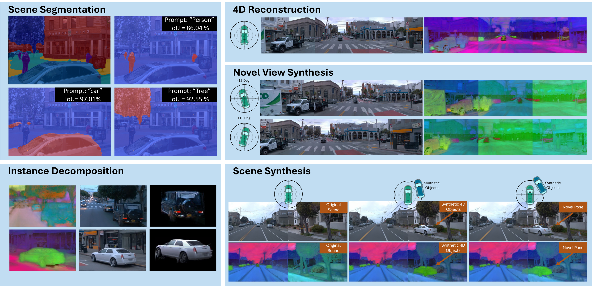
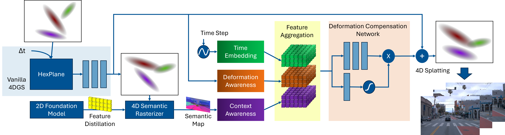
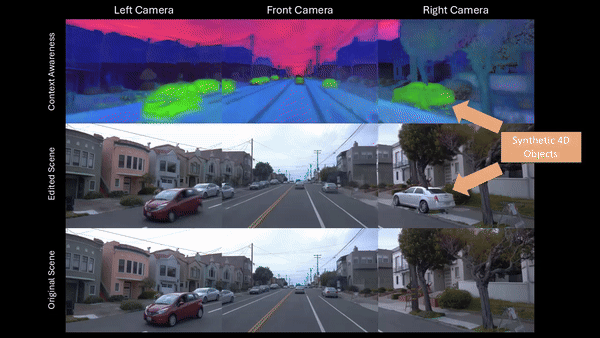

# CoDa-4DGS: Dynamic Scene Rendering with Context and Deformation Awareness for Autonomous Driving

<p align="center">
  <a href="https://rruisong.github.io/publications/CoDa-4DGS/">
    
  </a>
  <a href="https://arxiv.org/abs/2503.06744">
    
  </a>
</p>

> **CoDa-4DGS: Dynamic Gaussian Splatting with Context and Deformation Awareness for Autonomous Driving**, ICCV 2025.

> [Rui Song](https://rruisong.github.io/), [Chenwei Liang](https://chenwei-liang.github.io/), [Yan Xia](https://yan-xia.github.io/), [Walter Zimmer](https://www.ce.cit.tum.de/air/people/walter-zimmer-msc/), [Hu Cao](https://hucaofighting.github.io/), [Holger Caesar](https://sites.google.com/it-caesar.de/homepage/), [Andreas Festag](https://festag-net.de/), [Alois Knoll](https://www.ce.cit.tum.de/air/people/prof-dr-ing-habil-alois-knoll/)



## Abstract

Dynamic scene rendering opens new avenues in autonomous driving by enabling closed-loop simulations with photorealistic data, which is crucial for validating end-to-end algorithms. However, the complex and highly dynamic nature of traffic environments presents significant challenges in accurately rendering these scenes. In this paper, we introduce a novel 4D Gaussian Splatting (4DGS) approach, which incorporates context and temporal deformation awareness to improve dynamic scene rendering. Specifically, we employ a 2D semantic segmentation foundation model to self-supervise the 4D semantic features of Gaussians, ensuring meaningful contextual embedding. Simultaneously, we track the temporal deformation of each Gaussian across adjacent frames. By aggregating and encoding both semantic and temporal deformation features, each Gaussian is equipped with cues for potential deformation compensation within 3D space, facilitating a more precise representation of dynamic scenes. Experimental results show that our method improves 4DGS's ability to capture fine details in dynamic scene rendering for autonomous driving and outperforms other self-supervised methods in 4D reconstruction and novel view synthesis. Furthermore, CoDa-4DGS deforms semantic features with each Gaussian, enabling broader applications.

## Framework Overview


System overview of CoDa-4DGS. Vanilla 4DGS encodes and decodes temporal deformation using HexPlane encoding. Building on this, ours embeds temporal information and aggregates it with context and temporal deformation awareness through a Deformation Compensation Network (DCN). This network encodes the deformation adjustments needed to compensate for the original temporal deformation, ultimately producing an enhanced set of 4D Gaussians.

## Use Case 1: Novel View Synthesis


## Use Case 2: Scene Editing


## Environment Setup
```bash
cd coda-4dgs

# Initialize conda env
conda create -y --name coda-4dgs python=3.9
conda activate coda-4dgs
pip install torch==2.2.1 torchvision==0.17.1 torchaudio==2.2.1 --index-url https://download.pytorch.org/whl/cu118
conda install -c "nvidia/label/cuda-11.8.0" cuda-toolkit
pip install -r requirements.txt
pip install submodules/diff-gaussian-rasterization-feature
pip install submodules/simple-knn
```

## Preparing Dataset
We use the structure of NeRF On-The-Road (NOTR) Dataset as the standard dataset format for loading the data.

1. Prepare waymo dataset:

   Follow detailed instructions in [Prepare Dataset](docs/prepare_data.md).

2. Prepare semantic feature map:

   Download the LSeg model file demo_e200.ckpt from [the Google drive](https://drive.google.com/file/d/1ayk6NXURI_vIPlym16f_RG3ffxBWHxvb/view) and place it under the folder: lseg_encoder.
   
    ```
   cd encoders/lseg_encoder
   CUDA_VISIBLE_DEVICES=0 python -u encode_images.py --backbone clip_vitl16_384 --weights demo_e200.ckpt --widehead --no-scaleinv --outdir ../../data/DATASET_NAME/rgb_feature_langseg --test-rgb-dir ../../data/DATASET_NAME/images --workers 0
    ```

## Quick Start   

### Training

1. Locate the training configuration file:

   Edit the following file to set up training:

   `CoDa-4DGS/arguments/config.yaml`

2. Set paths for training and evaluation:

   Update the configuration with the appropriate paths:

   `source_path: Path to the Waymo dataset directory.`
   `semantic_feature_path: Path to the directory containing semantic feature maps.`
   `model_path: Path to the directory for storing experiment outputs and models.`
   `start_checkpoint: Path to an existing checkpoint to resume training. Leave it as '' to start training from scratch.`


3. Start training:

   Run the following command to begin the training process:

    ```
    python main_train.py --config_yaml "arguments/config.yaml"
    ```


### Evaluation and Visualization

1. Locate the training configuration file:

   Edit the following file to set up evaluation:

   `CoDa-4DGS/arguments/config.yaml`

2. Set the checkpoint path and evaluation mode:
   
   Update the configuration with:

   `start_checkpoint:/PATH/TO/CHECKPOINT`
   `eval_only: True`

3. Run the evaluation:

   Execute the following command to start the evaluation process:

    ```
    python main_train.py --config_yaml "arguments/config.yaml"
    ```
   Then you can get rendering RGB videos, ground truth RGB videos and feature map videos.

## Acknowledgments
Our repo is developed based on [3D Gaussian Splatting](https://repo-sam.inria.fr/fungraph/3d-gaussian-splatting/), [4D Gaussians](https://github.com/hustvl/4DGaussians/tree/master), [Feature 3DGS](https://github.com/ShijieZhou-UCLA/feature-3dgs/tree/main) and [S<sup>3</sup>Gaussian](https://github.com/nnanhuang/S3Gaussian/tree/main). Many thanks to the authors for opensoucing the codebase.
## Citation
If this work is helpful for your research, please cite the following BibTeX entry.
 ```bibtex
@inproceedings{song2025coda,
  title={Coda-4dgs: Dynamic gaussian splatting with context and deformation awareness for autonomous driving},
  author={Song, Rui and Liang, Chenwei and Xia, Yan and Zimmer, Walter and Cao, Hu and Caesar, Holger and Festag, Andreas and Knoll, Alois},
  publisher={IEEE/CVF},
  booktitle={IEEE/CVF International Conference on Computer Vision (ICCV)},
  year={2025}
}
```
